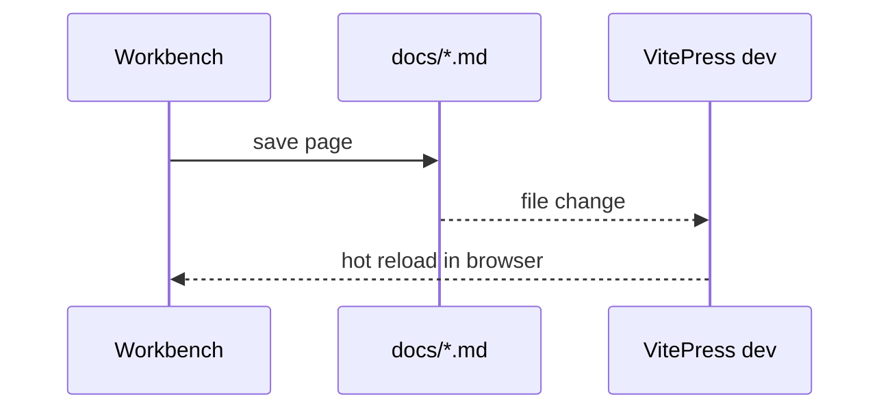

# Diagrams & math

The site ships with `vitepress-plugin-mermaid` and KaTeX, so architecture
diagrams and formulas are first-class Markdown citizens.

## Mermaid

Wrap a ```mermaid fenced block and it renders as an interactive chart in both
light and dark themes:


Sequence diagrams work too:



## KaTeX math

Inline math such as $E = mc^2$ flows inside paragraphs. Block math gets its
own centered block:

$$
\text{coverage} = \frac{\text{documented pages}}{\text{total pages}} \times 100\%
$$

## When to diagram

- Architecture overviews → `flowchart` / `architecture`
- Request flows and protocols → `sequenceDiagram`
- State machines → `stateDiagram-v2`

Keep charts next to the prose that explains them; a chart without a
surrounding explanation ages poorly.
